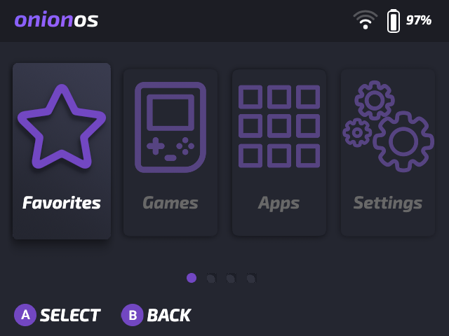
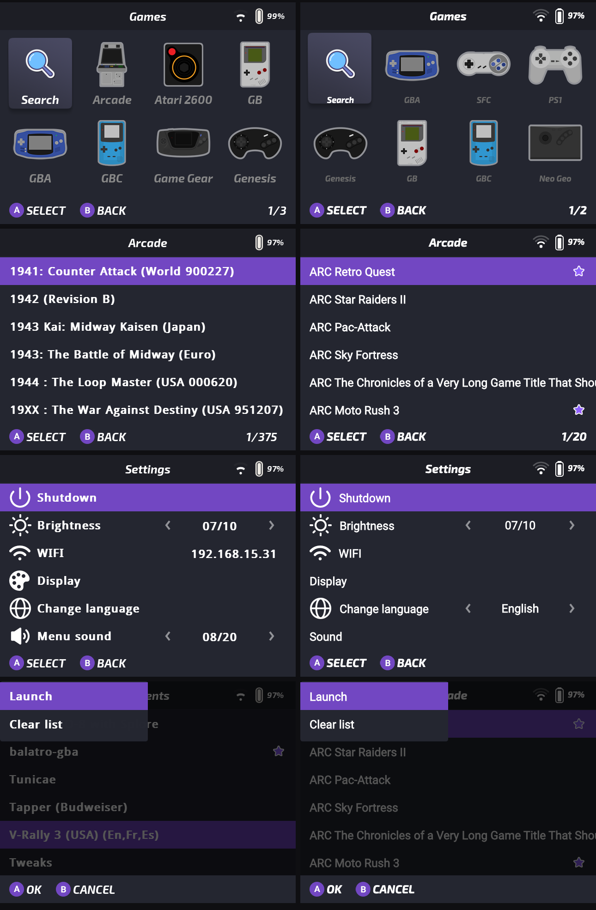

# onion_device_preview

Flutter package that renders a **Miyoo Mini / Mini+** mockup running
[OnionOS](https://github.com/OnionUI/Onion), applying a theme straight from a
`.zip`'s bytes — with mocked device state (battery, wi-fi, screens, keyboard
navigation) so you can preview themes without a console at hand.



Rendering is calibrated **1:1 against the firmware** — derived from its source
where it's open, and measured against native device screenshots where it isn't
(≤2px deviation).



> **Scope**: personal project, published for visibility. It works and it's
> tested, but there's no commitment to support, roadmap or API stability. Feel
> free to fork; issues and PRs may go unanswered.

## API usage

```dart
import 'package:onion_device_preview/onion_device_preview.dart';

final controller = OnionPreviewController();

// A theme from a zip...
final bundle = OnionThemeBundle.fromZipBytes(zipBytes);
await controller.loadTheme(bundle); // atomic: on failure the old theme stays

// ...or the bundled default skin:
await controller.loadTheme(OnionThemeBundle.defaultTheme());

// In the widget tree:
MiyooDeviceShell(controller: controller)   // full clickable device
OnionScreen(controller: controller)        // just the 640x480 screen (zoom fit/1x/1.5x/2x)
ThemeInspector(controller: controller)     // theme diagnostics panel
```

- **Packs** (a zip holding several themes): `bundle.isPack` /
  `bundle.availableRoots` / `bundle.withRoot(path)`.
- **Mocked state**: `setBatteryPercent`, `setCharging`, `setWifi`,
  `setExpertMode`, `setShowRecents`, `setForceHideLabels`, `setSoundEnabled`,
  `setApplyThemeIcons`, `setGsHistoryEmpty`, plus navigation via
  `pressA/B/X/Y/Start/Select/Menu` and `moveUp/Down/Left/Right`.
- **Keyboard** (RetroArch layout): arrows = D-pad, `X` = A, `Z` = B, `A` = Y,
  `S` = X, `Enter` = Start, `Shift` = Select, `Esc` = Menu (Game Switcher).

## Using it from another project

Not on pub.dev — depend on it from git:

```yaml
dependencies:
  onion_device_preview:
    git:
      url: https://github.com/andreyneto/onion_device_preview.git
      ref: v0.1.0
```

Package assets resolve on their own, so nothing extra is needed in the
consuming app.

## Running the example (web)

```bash
cd example
flutter run -d chrome
```

Drop zone for theme `.zip`s (drag onto the window), file picker, sub-theme
selector for packs, full control panel and the inspector. Any theme from
[OnionUI/Themes](https://github.com/OnionUI/Themes) works — prebuilt zips are
in `release/`, or zip a `themes/<Name>/` folder yourself.

## Architecture

| Layer | What |
|---|---|
| `src/core/` | `OnionThemeBundle` (in-memory zip, packs), `OnionThemeConfig` (lenient parser mirroring the firmware's fallbacks), `AssetResolver` (theme → default skin → null), `IconPackResolver`, `OnionFontResolver`, mock data |
| `src/device/` | `OnionPreviewController` (ChangeNotifier: resolved theme, navigation stack, cursors, per-screen handlers, sound), `MiyooDeviceShell`, `InputMapper`, `OnionSoundBank` |
| `src/screens/` | The screens as fixed-coordinate blits (main menu, game systems, lists, apps, Game Switcher, dialog, pop menu, boot/charging/shutdown) + shared header/footer |
| `src/inspector/` | `ThemeInspector` (config provenance, assets found/missing, fonts) |

Implementation rule: **no flexible layout inside the screens** — only
fixed-coordinate blits on the logical 640×480 canvas, mirroring the firmware's
`SDL_BlitSurface`. Every coordinate carries an evidence tag in the source
comments: derived from the firmware's own code, or measured against a device
capture.

## Tests

```bash
flutter test                          # includes goldens of the calibrated screens
flutter test --update-goldens         # regenerate goldens deliberately
```

Two layers beyond the unit tests: **goldens** freeze what this package draws,
and `device_conformance_test.dart` compares renders against native device
captures in `test/fixtures/device/` — so an accidentally regenerated golden
still gets caught.

## License

**GPL v3** (`LICENSE`), matching [OnionUI/Onion](https://github.com/OnionUI/Onion),
whose default skin and system fonts are bundled under `assets/default_skin/` as
the fallback the firmware itself applies for assets a theme doesn't ship.
